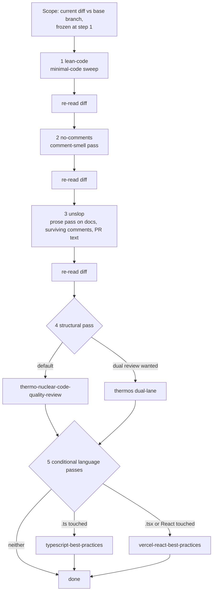

# De-slop sequence

Step labels match `skills/de-slop/SKILL.md` run order 1-5. Scope freezes
at step 1; the diff is re-read after each step; later passes see what
earlier passes left behind.

```mermaid
flowchart TD
    SC[Scope: current diff vs base branch,<br/>frozen at step 1] --> A[1 lean-code<br/>minimal-code sweep]
    A --> R1[re-read diff] --> B[2 no-comments<br/>comment-smell pass]
    B --> R2[re-read diff] --> C[3 unslop<br/>prose pass on docs, surviving comments, PR text]
    C --> R3[re-read diff] --> D{4 structural pass}
    D -->|default| D1[thermo-nuclear-code-quality-review]
    D -->|dual review wanted| D2[thermos dual-lane]
    D1 --> E{5 conditional language passes}
    D2 --> E
    E -->|.ts touched| E1[typescript-best-practices]
    E -->|.tsx or React touched| E2[vercel-react-best-practices]
    E -->|neither| DONE[done]
    E1 --> DONE
    E2 --> DONE
```
