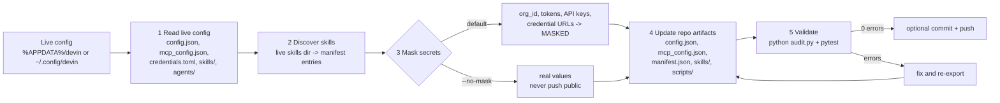

# Export cycle

Live Devin CLI config to versioned bundle artifacts. Masking is on by
default (`-NoMask` / `--no-mask` opts out); see
`.devin/docs/BUSINESS-LOGIC.md` for the masking contract.

```mermaid
flowchart LR
    LIVE[Live config<br/>%APPDATA%/devin or ~/.config/devin] --> RD[1 Read live config<br/>config.json, mcp_config.json,<br/>credentials.toml, skills/, agents/]
    RD --> DISC[2 Discover skills<br/>live skills dir -> manifest entries]
    DISC --> MASK{3 Mask secrets}
    MASK -->|default| M1[org_id, tokens, API keys,<br/>credential URLs -> MASKED]
    MASK -->|--no-mask| M0[real values<br/>never push public]
    M1 --> STG[4 Update repo artifacts<br/>config.json, mcp_config.json,<br/>manifest.json, skills/, scripts/]
    M0 --> STG
    STG --> AUD[5 Validate<br/>python audit.py + pytest]
    AUD -->|0 errors| CMT[optional commit + push]
    AUD -->|errors| FIX[fix and re-export]
    FIX --> STG
```
