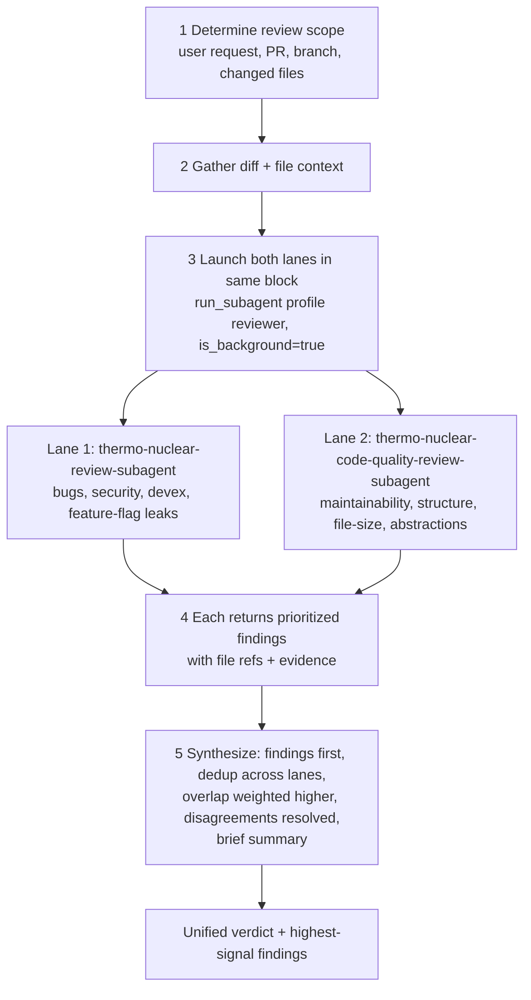

# Thermos dual-lane review

Step labels match `skills/thermos/SKILL.md` workflow steps 1-5.

```mermaid
flowchart TD
    S1[1 Determine review scope<br/>user request, PR, branch, changed files] --> S2[2 Gather diff + file context]
    S2 --> S3[3 Launch both lanes in same block<br/>run_subagent profile reviewer, is_background=true]
    S3 --> L1[Lane 1: thermo-nuclear-review-subagent<br/>bugs, security, devex, feature-flag leaks]
    S3 --> L2[Lane 2: thermo-nuclear-code-quality-review-subagent<br/>maintainability, structure, file-size, abstractions]
    L1 --> S4[4 Each returns prioritized findings<br/>with file refs + evidence]
    L2 --> S4
    S4 --> S5[5 Synthesize: findings first, dedup across lanes,<br/>overlap weighted higher, disagreements resolved,<br/>brief summary]
    S5 --> OUT[Unified verdict + highest-signal findings]
```
