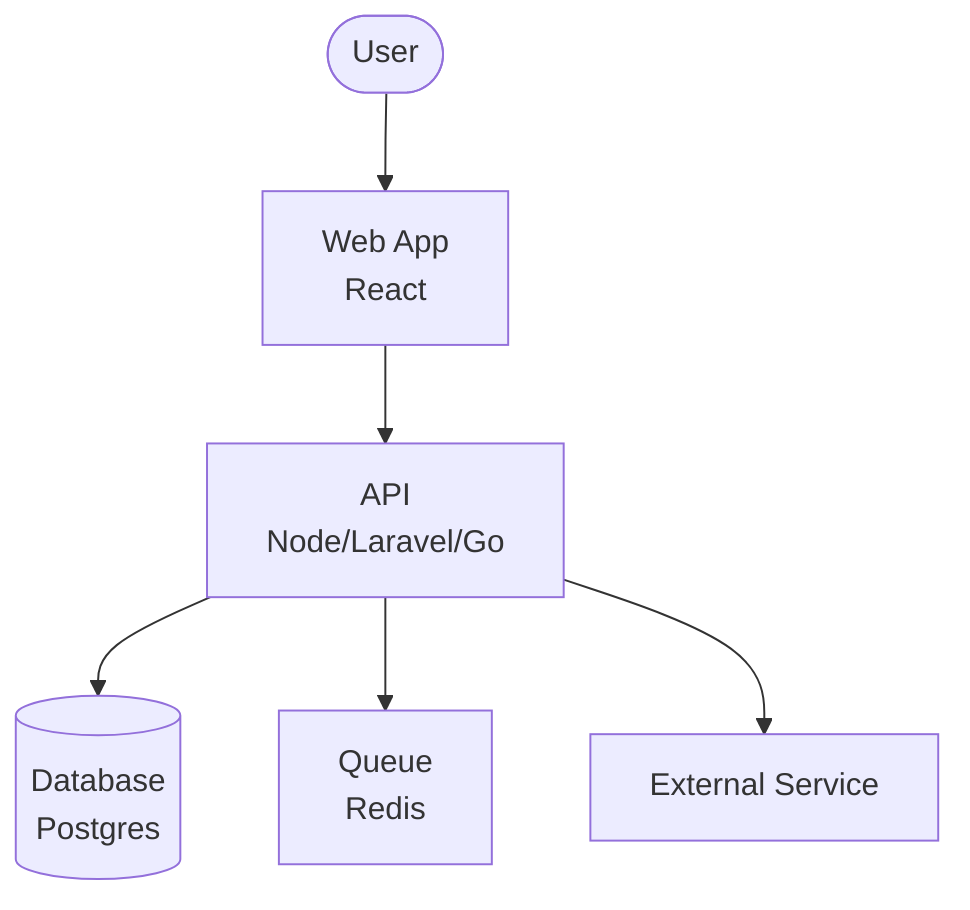

# Container Diagram

```mermaid
graph TB
  User([User]) --> Web[Web App<br/>React]
  Web --> API[API<br/>Node/Laravel/Go]
  API --> DB[(Database<br/>Postgres)]
  API --> Queue[Queue<br/>Redis]
  API --> Ext[External Service]
```

## Links
- [[02-Architecture]]
