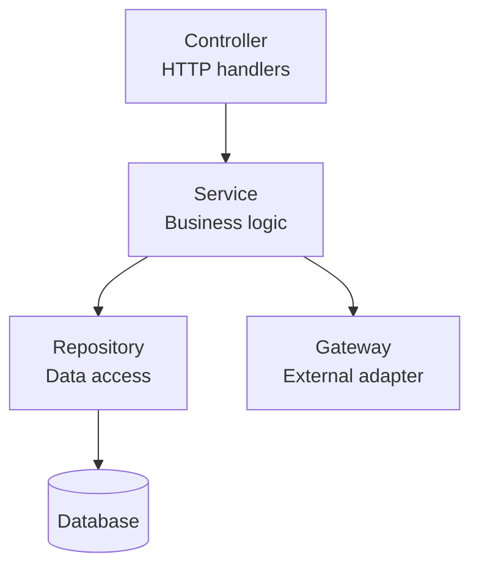

# Component Diagram

```mermaid
graph TB
  Ctrl[Controller<br/>HTTP handlers] --> Svc[Service<br/>Business logic]
  Svc --> Repo[Repository<br/>Data access]
  Svc --> Gateway[Gateway<br/>External adapter]
  Repo --> DB[(Database)]
```

## Links
- [[02-Architecture]]
