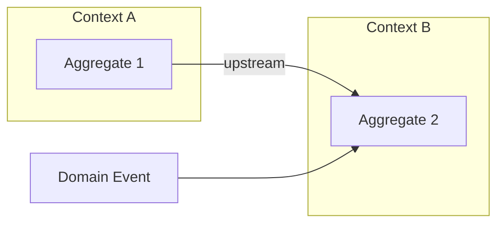

# Domain Context Map

```mermaid
graph LR
  subgraph ContextA[Context A]
    A1[Aggregate 1]
  end
  subgraph ContextB[Context B]
    B1[Aggregate 2]
  end
  A1 -->|upstream| B1
  Event[Domain Event] --> B1
```

## Links
- [[02-Architecture]]
