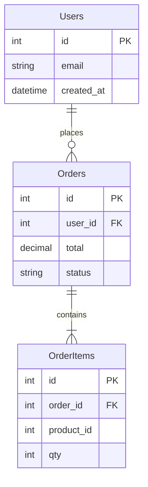

# Data Model

```mermaid
erDiagram
  Users ||--o{ Orders : places
  Orders ||--|{ OrderItems : contains
  Users {
    int id PK
    string email
    datetime created_at
  }
  Orders {
    int id PK
    int user_id FK
    decimal total
    string status
  }
  OrderItems {
    int id PK
    int order_id FK
    int product_id
    int qty
  }
```

## Links
- [[03-Database]]
