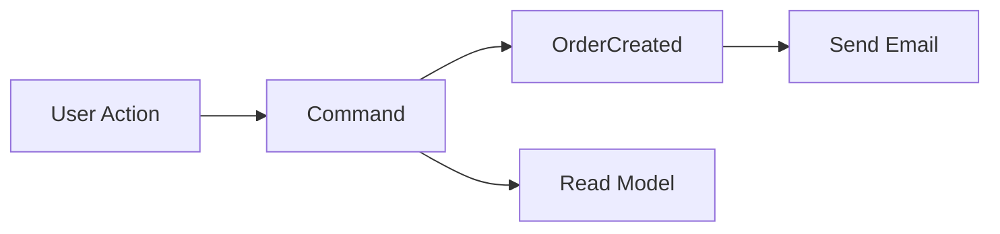

# Data / Event Flow

<!-- Sources: src/commands/OrderCommand.ts:1, src/events/OrderCreated.ts:1, src/handlers/EmailHandler.ts:1 -->

```mermaid
graph LR
  Trigger[User Action] --> Cmd[Command]
  Cmd --> Event[OrderCreated]
  Event --> Handler[Send Email]
  Cmd --> Read[Read Model]
```

## Links
- [[02-Architecture]]
