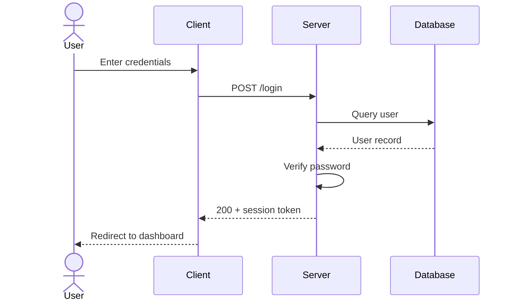

# Sequence Diagram — Authentication Flow

<!-- Sources: src/auth/login.ts:1, src/auth/session.ts:1, src/middleware/auth.ts:1 -->

```mermaid
sequenceDiagram
  actor U as User
  participant C as Client
  participant S as Server
  participant DB as Database
  U->>C: Enter credentials
  C->>S: POST /login
  S->>DB: Query user
  DB-->>S: User record
  S->>S: Verify password
  S-->>C: 200 + session token
  C-->>U: Redirect to dashboard
```

## Links
- [[02-Architecture]]
- [[Modules/Auth]]
