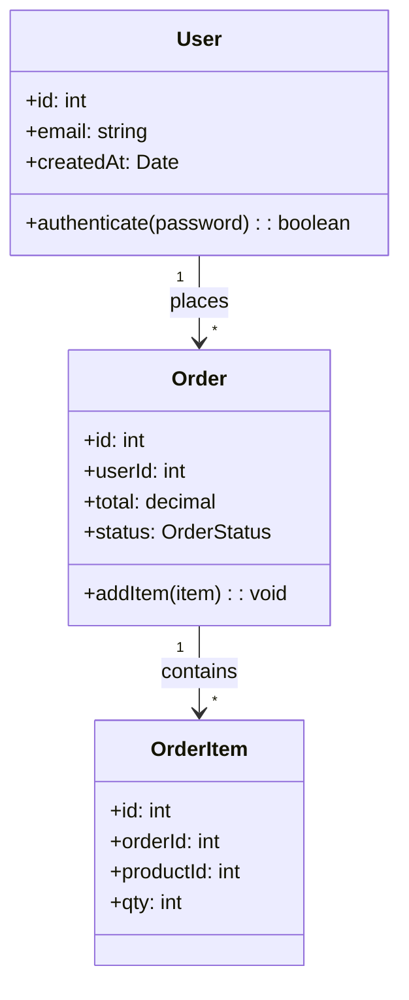

# Class Diagram — Core Domain Types

<!-- Sources: src/models/User.ts:1, src/models/Order.ts:1, src/models/OrderItem.ts:1 -->

```mermaid
classDiagram
  class User {
    +id: int
    +email: string
    +createdAt: Date
    +authenticate(password): boolean
  }
  class Order {
    +id: int
    +userId: int
    +total: decimal
    +status: OrderStatus
    +addItem(item): void
  }
  class OrderItem {
    +id: int
    +orderId: int
    +productId: int
    +qty: int
  }
  User "1" --> "*" Order : places
  Order "1" --> "*" OrderItem : contains
```

## Links
- [[02-Architecture]]
- [[03-Database]]
