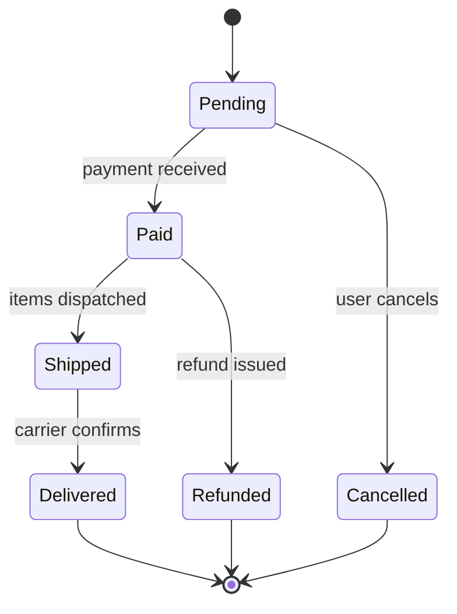

# State Machine — Order Lifecycle

<!-- Sources: src/models/Order.ts:1, src/services/OrderService.ts:1 -->

```mermaid
stateDiagram-v2
  [*] --> Pending
  Pending --> Paid: payment received
  Paid --> Shipped: items dispatched
  Shipped --> Delivered: carrier confirms
  Delivered --> [*]
  Pending --> Cancelled: user cancels
  Paid --> Refunded: refund issued
  Cancelled --> [*]
  Refunded --> [*]
```

## Links
- [[02-Architecture]]
- [[Modules/OrderService]]
