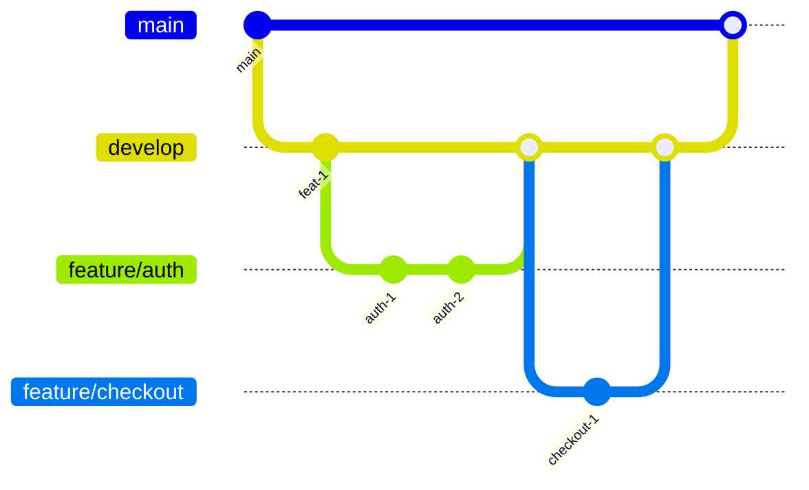

# Git Graph — Branching Strategy

<!-- Sources: .github/workflows/ci.yml:1, CONTRIBUTING.md:1 -->

```mermaid
gitGraph
  commit id: "main"
  branch develop
  checkout develop
  commit id: "feat-1"
  branch feature/auth
  checkout feature/auth
  commit id: "auth-1"
  commit id: "auth-2"
  checkout develop
  merge feature/auth
  branch feature/checkout
  checkout feature/checkout
  commit id: "checkout-1"
  checkout develop
  merge feature/checkout
  checkout main
  merge develop
```

## Links
- [[02-Architecture]]
