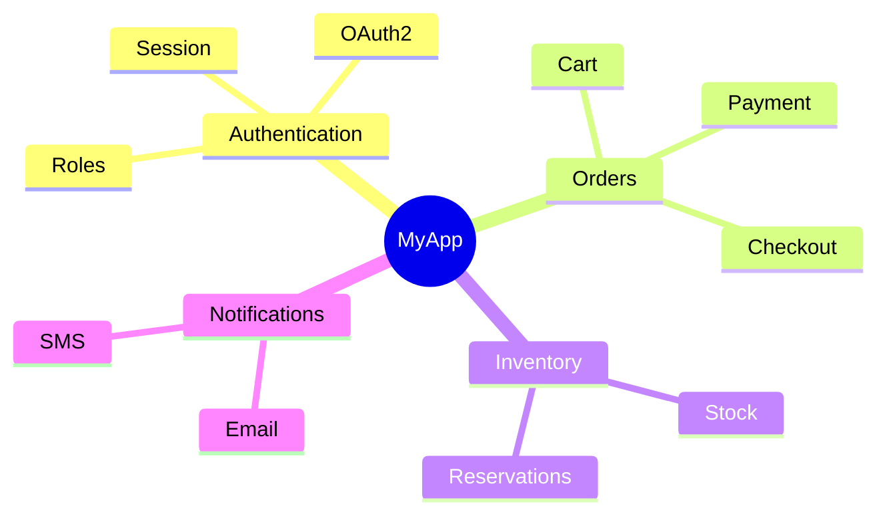

# Mindmap — Feature / Domain Overview

<!-- Sources: README.md:1, src/index.ts:1 -->

```mermaid
mindmap
  root((MyApp))
    Authentication
      OAuth2
      Session
      Roles
    Orders
      Cart
      Checkout
      Payment
    Inventory
      Stock
      Reservations
    Notifications
      Email
      SMS
```

## Links
- [[02-Architecture]]
