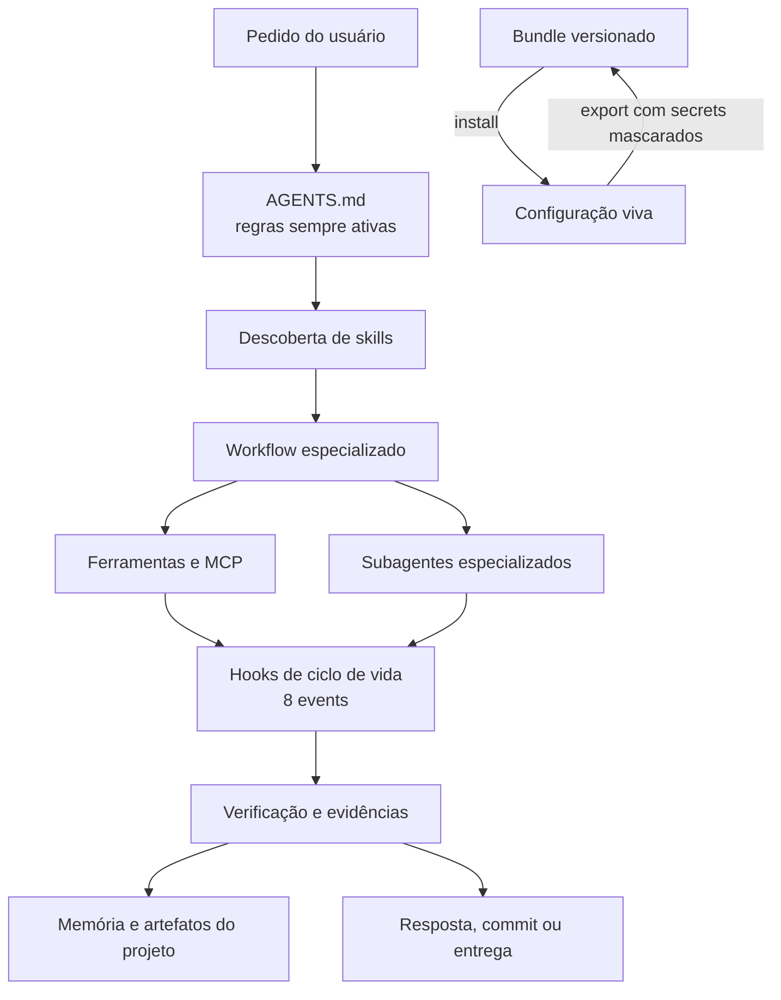
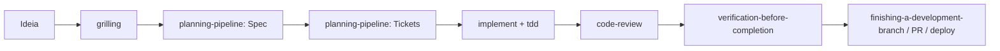

# devin-bundle

[](https://github.com/Leostruka/devin-bundle/actions/workflows/ci.yml)
[](https://opensource.org/licenses/MIT)
[](#2-skills)
[](#1-regras-globais)
[](CHANGELOG.md)

Ecossistema versionado para o Devin CLI. O bundle sincroniza entre máquinas as regras, skills, perfis de subagentes, hooks, scripts, configuração e metadados que governam todo o ciclo de trabalho: da ideia ao planejamento, implementação, revisão, memória e entrega.

## Início rápido

```powershell
git clone https://github.com/Leostruka/devin-bundle.git
cd devin-bundle
.\install.ps1 -Force
```

Linux, macOS ou WSL:

```bash
git clone https://github.com/Leostruka/devin-bundle.git
cd devin-bundle
./install.sh --force
```

> Estado atual: o instalador Unix copia `config.json` sem converter o placeholder Windows `{{APPDATA}}` usado pelos hooks globais. Skills, agents e demais arquivos são instalados, mas os hooks globais exigem correção manual dos comandos para `${XDG_CONFIG_HOME:-$HOME/.config}/devin/scripts/` ou uso do template de projeto `.devin/hooks.v1.json` até o instalador ser corrigido.

Depois da instalação, abra o Devin CLI no repositório em que deseja trabalhar. O runtime carregará as regras globais, descobrirá as skills conforme a tarefa e executará os hooks automaticamente.

## Pré-requisitos

| Requisito | Finalidade | Verificação |
|---|---|---|
| [Devin CLI](https://devin.ai) | Runtime do agente | `devin --version` |
| Python 3.8+ | Hooks, auditoria e testes | `python --version` |
| Git | Versionamento, branches e worktrees | `git --version` |
| Windows, Linux, macOS ou WSL | Ambiente suportado | — |

A versão validada do Devin CLI é `3000.6.7`. Consulte [docs/DEVIN-CLI-COMPATIBILITY.md](docs/DEVIN-CLI-COMPATIBILITY.md).

## Como o ecossistema funciona

O repositório é a **fonte versionada e distribuível**. A instalação copia ou mescla seus recursos na **configuração viva** do Devin CLI. Durante uma sessão, cada camada tem uma responsabilidade diferente:



1. **O usuário descreve o resultado desejado.**
2. **As regras globais delimitam o comportamento.** Elas exigem descoberta de skills, execução objetiva, uso de ferramentas para verificar fatos, planejamento proporcional e evidência antes da conclusão.
3. **Uma ou mais skills definem o processo.** Skills não ficam todas no contexto: são carregadas somente quando o gatilho da tarefa corresponde.
4. **O agente usa ferramentas diretamente ou delega trabalho independente.** Perfis customizados separam arquitetura, pesquisa, implementação, debugging e revisão.
5. **Hooks inspecionam o ciclo automaticamente.** Eles validam argumentos, bloqueiam operações perigosas, detectam assinaturas de IA, protegem pushes, monitoram pressão de contexto e recuperam memória relevante.
6. **A conclusão depende de verificação real.** Audit, testes, lint, build ou checks específicos precisam ser executados antes de qualquer declaração de sucesso.
7. **Conhecimento durável pode ser registrado.** Decisões, regras de negócio e abordagens fracassadas podem virar memória auditável em `.devin/memory/`, sempre com aprovação do usuário.
8. **Install e export fecham o ciclo entre máquinas.** O install leva o bundle ao runtime; o export traz a configuração viva de volta ao Git, mascarando segredos por padrão.

## Camadas do ecossistema

### 1. Regras globais

`AGENTS.md` é carregado em toda sessão e contém 20 regras consolidadas, formuladas principalmente como restrições e complementadas por procedimentos verificáveis. As regras centrais determinam que o agente:

- descubra e invoque skills antes de ações não triviais;
- execute pedidos claros sem reformular ou oferecer opinião não solicitada;
- responda de forma telegráfica;
- use `read`, `exec`, `grep`, glob ou ferramentas equivalentes em vez de deduzir o estado real;
- planeje tarefas com três ou mais etapas;
- não declare conclusão sem checks recentes;
- não faça push sem estado verde;
- não exponha segredos nem adicione assinaturas de IA;
- mantenha o contexto enxuto e preserve constraints após compactação;
- valide melhorias contra testes held-out para evitar ganhos ilusórios.

O arquivo de projeto `.devin/global_rules.md` complementa as regras globais para este repositório. Regras específicas de um projeto consumidor devem ficar em sua própria pasta `.devin/`.

### 2. Skills

As 76 skills são workflows invocáveis em `skills/<nome>/SKILL.md`. O `manifest.json` mantém nome, origem e finalidade, enquanto o diretório em disco é a fonte descoberta pelo exportador.

As skills são carregadas sob demanda. A forma recomendada de escolher é:

1. invocar `using-skills` no início;
2. usar `ask-matt` quando o fluxo completo estiver incerto;
3. usar `tool-and-skill-discovery` quando nenhuma skill conhecida corresponder;
4. consultar [docs/SKILL-TIERS.md](docs/SKILL-TIERS.md) para descoberta por domínio e custo de contexto;
5. carregar apenas as 1–3 skills necessárias para a tarefa.

Principais grupos:

| Grupo | Skills principais | Uso |
|---|---|---|
| Ideação e decisão | `grilling`, `wayfinder`, `prototype`, `research` | Tornar uma ideia precisa antes de construir |
| Planejamento | `planning-pipeline`, `writing-plans`, `executing-plans` | Gerar PRD, tickets verticais ou plano detalhado |
| Implementação | `implement`, `tdd`, `codebase-design` | Construir comportamento test-first em módulos profundos |
| Execução autônoma | `afk-loop`, `autonomous-gates`, `unlazy` | Trabalhar sem supervisão contínua com gates verificáveis |
| Qualidade | `code-review`, `receiving-code-review`, `mutation-testing`, `verification-before-completion` | Revisar spec, padrões, testes e evidências |
| Diagnóstico | `diagnosing-bugs`, `debug-ci-failures` | Reproduzir, localizar causa raiz e corrigir regressões |
| Arquitetura | `improve-codebase-architecture`, `codebase-design`, `legacy-refactor` | Aprofundar módulos e reduzir dependências rasas |
| Contexto e memória | `context-window-hygiene`, `context-folding`, `project-memory`, `memory-hygiene`, `handoff` | Controlar contexto e preservar conhecimento útil |
| Git e entrega | `using-git-worktrees`, `git-helper`, `gh`, `pr-review`, `finishing-a-development-branch`, `deploy` | Isolar, revisar, integrar e publicar trabalho |
| Infra e especialidades | `security-audit`, `a11y-audit`, `api-design`, `database`, `e2e-testing`, `i18n`, `docker`, `performance`, `observability-quality` | Aplicar processos especializados |
| Extensão do harness | `project-setup`, `self-extend`, `setup-pre-commit`, `devin-manager`, `continuous-improvement` | Configurar e evoluir o ecossistema |

### 3. Perfis de subagentes

O parent coordena o trabalho e pode delegar subtarefas independentes. Cada subagente recebe contexto próprio, evitando poluir a janela principal.

| Perfil | Responsabilidade | Escrita |
|---|---|---|
| `architect` | Decisões arquiteturais e trade-offs | Não |
| `researcher` | Reconhecimento de codebase e fontes externas | Não |
| `debugger` | Reprodução e análise sistemática de falhas | Execução controlada |
| `implementer` | Código, testes e verificação de uma tarefa delimitada | Sim |
| `reviewer` | Revisão independente de Standards e Spec | Não |
| `subagent_explore` | Exploração built-in | Não |
| `subagent_general` | Trabalho geral built-in | Sim |

Com o parent gratuito em `glm-5-2`, prefira o perfil customizado `researcher`: `subagent_explore` resolve para SWE-1.6 pago no router padrão. Use `subagent_general` quando a subtarefa realmente precisar herdar o modelo e as ferramentas gerais do parent.

Os cinco perfis customizados estão em `agents/` e usam `swe-1-7`. O parent usa `glm-5-2`. Consulte [docs/MODEL-GUIDE.md](docs/MODEL-GUIDE.md).

### 4. Ferramentas e MCP

O agente opera arquivos, shell, busca, notebooks, browser, subagentes, tarefas e integrações por ferramentas estruturadas. `validate-tool-args.py` valida as chamadas não triviais antes da execução.

O MCP configurado é `atlassian`, usado para Jira e Confluence quando autenticado. Antes de chamar um MCP, o agente lista os servidores e ferramentas disponíveis; definições MCP desnecessárias devem permanecer desabilitadas para não consumir contexto. O mapa completo está em [docs/TOOLS-MAP.md](docs/TOOLS-MAP.md).

### 5. Hooks

Os hooks são controles determinísticos ao redor do modelo. Eles recebem JSON pelo `stdin`; hooks bloqueadores retornam exit code `2` com `decision: block` e o motivo.

| Evento | Função no ecossistema |
|---|---|
| `SessionStart` | Limpa markers antigos e informa o orçamento de contexto |
| `UserPromptSubmit` | Reinjeta constraints, aplica o self-check comportamental e busca memórias por cues |
| `PreToolUse` | Valida argumentos e bloqueia operações destrutivas, assinaturas de IA, Mermaid inválido e push sem green |
| `PostToolUse` | Detecta erro silencioso, mede pressão de contexto e recupera memória relacionada ao comando ou arquivo |
| `PostCompaction` | Registra constraints que precisam ser reinjetadas após compactação |
| `Stop` | Verifica assinatura, revisão de refinement e estado da memória |
| `SessionEnd` | Salva artefatos e registra o estado da memória |
| `PermissionRequest` | Evento suportado, atualmente sem handler ativo |

Há 15 scripts usados por hooks, 2 validadores manuais e 1 helper JavaScript para Mermaid em `scripts/`.

### 6. Configuração e distribuição

| Artefato | Responsabilidade |
|---|---|
| `config.json` | Modelo, UI, comportamento do shell e hooks globais |
| `.devin/hooks.v1.json` | Template de hooks para uso no escopo do projeto |
| `mcp_config.json` | Servidores MCP distribuíveis |
| `credentials.toml` | Arquivo local opcional gerado pelo export; mascarado por padrão e não versionado |
| `manifest.json` | Inventário e metadados das skills |
| `install.ps1` / `install.sh` | Bundle → configuração viva |
| `export.ps1` / `export.sh` | Configuração viva → bundle |
| `audit.py` | Consistência estrutural, segurança e sincronização |

## Fluxo operacional completo

### Preparação única de um projeto

Em um projeto ainda não preparado:

1. abra o Devin CLI na raiz;
2. peça para executar `project-setup` para a configuração geral ou `setup-matt-pocock-skills` para o fluxo de engenharia baseado em spec, tickets e triagem;
3. revise os arquivos criados em `.devin/`;
4. execute os checks de baseline do projeto;
5. versione apenas configuração não sensível.

### Fluxo principal: ideia → entrega



#### 1. Alinhar a ideia com `grilling`

`grilling` entrevista o usuário em rodadas de frontier. Cada pergunta deve ser assertiva e incluir uma recomendação do agente, reduzindo turnos vazios. Ao final, produz um **shared design concept** estruturado como PRD. Em repositórios, o modo With-docs preserva contexto em `.devin/CONTEXT.md` e decisões em `.devin/adr/`; fora de um repositório, use o modo Stateless.

Use quando o resultado ainda contém decisões. Para alterações pequenas e óbvias, `review-cadence` pode autorizar ir diretamente à implementação.

#### 2. Produzir o PRD com `planning-pipeline` Spec

O PRD é um **destination document**, não um resumo descartável. Ele registra:

- problema e solução do ponto de vista do usuário;
- histórias de usuário;
- módulos e interfaces propostos;
- contratos, schema e APIs afetados;
- decisões de teste;
- ativos vivos e ativos prototype/disposable;
- escopo excluído.

#### 3. Dividir em tickets verticais

O modo Tickets gera **tracer bullets**: cada ticket entrega um caminho estreito, completo e demonstrável através das camadas necessárias. Não dividir horizontalmente em “schema”, “API” e “UI” quando o comportamento puder ser entregue como uma fatia end-to-end.

Cada ticket declara `Blocked by:`. Isso forma um DAG; qualquer ticket aberto cujos blockers estejam resolvidos pertence à frontier e pode ser executado. Para tracker local, os arquivos ficam em `.devin/scratch/<feature>/issues/*.md`.

Para um trabalho focado de uma sessão, a alternativa é `writing-plans` → `executing-plans`, com passos pequenos e checkpoints explícitos.

#### 4. Implementar com TDD

`implement` usa `tdd` para cada comportamento:

1. **RED** — escrever primeiro um teste que representa comportamento ausente;
2. **verify RED** — executar e confirmar que falha pelo motivo correto;
3. **GREEN** — escrever a implementação mínima;
4. **verify GREEN** — executar e confirmar que o teste passa;
5. **REFLECT** — verificar se uma implementação errada, hardcoded ou tautológica passaria;
6. **REFACTOR** — melhorar o design somente com a suíte verde.

O feedback loop do projeto — testes, typecheck, lint ou build — define o teto de qualidade. Não escrever testes apenas depois da implementação e chamá-lo de TDD.

#### 5. Revisar com Push/Pull

`code-review` executa dois eixos independentes:

- **Spec:** o diff entrega o comportamento e os critérios aprovados?
- **Standards:** o diff respeita regras, arquitetura, segurança, testes e convenções?

Padrões **push** são colocados explicitamente no contexto do reviewer: spec, critérios e regras locais que precisam ser julgados. Padrões **pull** são responsabilidades que o implementer deve buscar e aplicar, como `tdd`, convenções do projeto e verification; o reviewer faz spot-check sem duplicar todo esse contexto. `receiving-code-review` usa a mesma distinção para decidir se o feedback revela ausência no prompt/review ou falha do implementer em consultar um padrão existente.

O Sand Castle é apenas um modelo mental para planner → implementers → merger/reviewer; o bundle não instala a biblioteca nem exige Docker.

#### 6. Verificar e finalizar

Antes de concluir:

1. executar os checks diretamente relacionados;
2. executar a suíte mais ampla apropriada;
3. revisar o diff e o status do Git;
4. confirmar que não há segredos, artefatos descartáveis ou assinaturas de IA;
5. usar `verification-before-completion`;
6. usar `finishing-a-development-branch` para escolher merge, PR ou manutenção da branch;
7. usar `gh`/`pr-review` para GitHub e `deploy` apenas quando a publicação for solicitada.

### Fluxo autônomo: `afk-loop`

Use quando tickets locais já estão aprovados e o agente deve trabalhar sem direção a cada etapa.

Pré-condições:

- issues em `.devin/scratch/<feature>/issues/*.md`;
- spec em `.devin/scratch/<feature>/spec.md`;
- status e `Blocked by:` preenchidos;
- worktree isolado e ignorado;
- baseline verde;
- autorização explícita para trabalho autônomo.

O loop:

1. lê spec e issues;
2. constrói o DAG;
3. escolhe o issue ready com menor número;
4. marca como claimed;
5. executa TDD e checks;
6. registra a resposta e marca resolved;
7. recalcula a frontier;
8. termina quando tudo está resolvido ou quando encontra blocker, decisão humana, baseline vermelho ou operação proibida.

O loop não faz push sem autorização e não trabalha diretamente em `main`/`master`. Ao terminar, use `finishing-a-development-branch`.

### Fluxos de entrada alternativos

| Situação | Entrada correta | Próximo passo |
|---|---|---|
| Bug difícil ou intermitente | `diagnosing-bugs` | Reproduzir → causa raiz → teste de regressão → TDD |
| CI falhando | `debug-ci-failures` | Isolar job/ambiente → corrigir → verificar |
| Issues externos brutos | `triage` | Transformar em issue agent-ready → `implement` |
| Projeto grande e nebuloso | `wayfinder` | Resolver decision tickets → PRD → tickets |
| Dúvida que precisa de código executável | `prototype` | Preservar aprendizado → voltar ao PRD |
| Pergunta factual extensa | `research` ou `deep-mode` | Gerar evidência citada → alimentar decisão |
| Informação depende de outra pessoa | `planning-pipeline` Questionnaire | Coletar respostas → Spec/Grilling |
| Conflito Git em andamento | `resolving-merge-conflicts` | Resolver por intenção → verificar operação |

## Arquitetura: módulos profundos

O ecossistema segue a heurística de John Ousterhout: um módulo deve esconder muita complexidade atrás de uma interface pequena. `improve-codebase-architecture` procura módulos rasos, pass-throughs, fan-out de dependências, wrappers sem abstração e contratos espalhados. `codebase-design` ajuda a redesenhar a seam escolhida.

Uso recomendado:

1. executar `improve-codebase-architecture` para encontrar oportunidades;
2. selecionar uma oportunidade com evidência;
3. usar `grilling` para delimitar o resultado;
4. declarar módulo e interface no PRD;
5. refatorar por fatias verificáveis;
6. testar pela interface pública do módulo profundo, não pelos wrappers rasos removidos.

## Memória e contexto

### Contexto da sessão

A janela contém prompt do sistema, ferramentas, regras, skills invocadas, conversa, leituras e respostas. Mais contexto não significa melhor recuperação: informação no meio pode perder prioridade.

- **Smart zone:** região em que o modelo ainda raciocina com boa precisão. O hook `context-budget.py` usa 100 mil tokens como limiar operacional conservador e o fluxo `ask-matt` trata aproximadamente 150 mil como limite superior conceitual para modelos modernos.
- **Continue:** preferível quando a fase ainda depende das fontes já carregadas.
- **Clear:** padrão quando a tarefa ou fase mudou e o contexto anterior não é necessário.
- **Compact:** usar somente quando a continuidade é necessária e não existe um artefato melhor; compactações repetidas acumulam perda e “sedimentação”.
- **Handoff:** usar para mover trabalho a outra sessão, diretório, harness ou pessoa.
- **Subagent:** usar para trabalho independente que merece uma janela própria.
- **Context folding:** usar para documentos muito grandes, particionando e recuperando por arquivos em vez de despejar tudo na conversa.

### Memória entre sessões

`project-memory` registra conhecimento durável como Markdown auditável em `.devin/memory/`:

1. o agente identifica algo reutilizável;
2. propõe texto e caminho;
3. o usuário aprova;
4. a nota é escrita com fontes e `cues:`;
5. o MOC é atualizado;
6. hooks recuperam a nota quando um comando, símbolo, path ou palavra-chave correspondente aparece.

Não guardar segredos, não capturar tudo automaticamente e não usar um único arquivo gigante. Preferências permanentes pertencem a rules; processos recorrentes pertencem a skills; decisões arquiteturais pertencem a ADRs.

## Segurança e verificação

O bundle combina governança textual e gates determinísticos:

- `destructive-gate.py` bloqueia padrões de comandos destrutivos;
- `check-ai-signature.py` bloqueia assinaturas em commits e arquivos;
- `check-push-green.py` exige checks verdes antes de push;
- `validate-tool-args.py` rejeita argumentos malformados;
- `validate-mermaid.py` valida diagramas alterados;
- `silent-error-review.py` procura falhas escondidas em respostas de ferramentas;
- `constraint-pinning.py` preserva regras após compactação;
- `validate-refinement-evidence.py` detecta claims de melhoria sem evidência;
- testes held-out protegem contra otimização apenas para testes escolhidos pelo agente.

Checks principais deste repositório:

```powershell
python audit.py
python -m pytest tests/held-out/ -q
python scripts/validate-skill-format.py
```

Os hooks não transformam o runtime em sandbox. Código não confiável deve ser executado em ambiente isolado. Credenciais nunca devem ser exibidas ou versionadas.

## Estrutura do repositório

```text
devin-bundle/
├── AGENTS.md                  # regras globais distribuídas
├── agents/                    # 5 perfis customizados
├── skills/                    # 76 workflows invocáveis
├── scripts/                   # hooks, validadores e helper Mermaid
├── .devin/                    # configuração e conhecimento deste projeto
│   ├── global_rules.md
│   ├── hooks.v1.json
│   ├── CONTEXT.md
│   ├── adr/
│   ├── memory/
│   ├── ledgers/
│   └── scratch/
├── config.json                # configuração global mascarada
├── mcp_config.json            # MCP mascarado
├── credentials.toml           # opcional/local, gerado pelo export e gitignored
├── manifest.json              # inventário das skills
├── install.ps1 / install.sh   # bundle → live config
├── export.ps1 / export.sh     # live config → bundle
├── audit.py                   # auditoria estrutural
├── tests/                     # validação e held-out
├── docs/                      # mapas, guias e planos
└── .github/                   # CI e templates GitHub
```

## Instalação

### Windows

```powershell
.\install.ps1                 # instala/mescla, preservando existentes
.\install.ps1 -DryRun         # simula
.\install.ps1 -Force          # sobrescreve diferenças
.\install.ps1 -Force -Backup  # sobrescreve com backup
.\install.ps1 -RestoreSecrets # restaura credentials.toml não mascarado
```

Destino: `%APPDATA%\devin\`.

### Linux, macOS ou WSL

```bash
./install.sh                   # instala/mescla
./install.sh --dry-run         # simula
./install.sh --force           # sobrescreve diferenças
./install.sh --restore-secrets # restaura credentials.toml não mascarado
```

Destino: `${XDG_CONFIG_HOME:-~/.config}/devin/`.

O instalador:

1. cria o destino;
2. instala `AGENTS.md`;
3. instala os perfis de `agents/`;
4. instala as skills descobertas;
5. mescla `config.json` por padrão, preservando `org_id` local;
6. instala scripts e hooks;
7. ignora MCP mascarado; no Windows, `Force` pode instalar sua estrutura mascarada, enquanto o instalador Unix sempre a ignora;
8. restaura credenciais somente com flag explícita;
9. relata itens instalados, mesclados, sobrescritos, ignorados e backupeados.

A operação é idempotente: sem `Force`, conteúdo idêntico ou existente é preservado conforme o contrato do instalador.

## Exportação e sincronização

O exportador sincroniza a configuração viva desta máquina de volta ao bundle.

### Windows

```powershell
.\export.ps1                  # exporta com secrets mascarados
.\export.ps1 -DryRun          # simula
.\export.ps1 -Commit          # exporta, valida e commita
.\export.ps1 -Commit -Push    # exporta, valida, commita e envia
.\export.ps1 -NoMask          # exporta secrets reais: nunca enviar a repo público
```

### Linux, macOS ou WSL

```bash
./export.sh                    # exporta com secrets mascarados
./export.sh --dry-run
./export.sh --commit
./export.sh --commit --push
./export.sh --no-mask          # nunca enviar a repo público
```

Por padrão:

| Arquivo | Mascaramento |
|---|---|
| `config.json` | `org_id` vira `MASKED` |
| `mcp_config.json` | valores de environment viram `MASKED` |
| `credentials.toml` | todos os valores viram `MASKED` |

Fluxo entre máquinas:

1. na origem, execute o export mascarado;
2. valide e envie o repositório;
3. no destino, clone ou atualize o Git;
4. execute o install com `Force` se quiser sincronização integral;
5. transfira credenciais reais fora do Git e use `RestoreSecrets` somente em ambiente confiável.

## Uso diário recomendado

1. Abra o Devin CLI na raiz do projeto.
2. Descreva o resultado, os critérios e qualquer autorização relevante.
3. Deixe o agente invocar as skills correspondentes antes de agir.
4. Para ideia nova: `grilling` → PRD → tickets → `implement`/`tdd` → review → verificação.
5. Para bug: `diagnosing-bugs` → reprodução → teste de regressão → fix → verificação.
6. Para trabalho noturno: prepare tickets locais, worktree e baseline; então peça `afk-loop` explicitamente.
7. Quando a tarefa mudar, prefira limpar o contexto; compacte apenas para preservar continuidade indispensável.
8. Aprove memórias somente quando forem úteis em sessões futuras.
9. Revise o diff e os checks antes de autorizar commit, push, merge ou deploy.
10. Após alterar a configuração viva, execute o export para manter o bundle atualizado.

Exemplos de pedidos:

```text
Use grilling para transformar esta ideia em um design concept e depois gere um PRD.
Quebre este PRD em tickets verticais com relações Blocked by.
Implemente o ticket 03 usando TDD e faça code-review nos eixos Standards e Spec.
Execute o afk-loop para .devin/scratch/minha-feature em um worktree isolado.
Diagnostique esta falha; primeiro crie um comando que a reproduza de forma confiável.
Audite a arquitetura e encontre módulos rasos que podem virar módulos profundos.
Registre esta regra de negócio na memória do projeto e me mostre o texto antes de salvar.
```

## Troubleshooting

| Problema | Diagnóstico | Correção |
|---|---|---|
| Skills não aparecem | Caminho de instalação incorreto | Verifique `%APPDATA%\devin\skills\` ou `~/.config/devin/skills/` |
| Hooks não executam globalmente | Hooks fora de `config.json` | Reinstale; hooks globais ficam em `config.json` |
| Hooks de projeto não executam | Template não instalado no projeto | Verifique `.devin/hooks.v1.json` |
| Push é bloqueado | Baseline, testes ou held-out falharam | Corrija a falha e execute novamente; não contorne o hook |
| Stop detecta assinatura | Diff contém atribuição proibida | Remova a assinatura e verifique o diff |
| Export aborta | JSON, Python ou auditoria inválida | Corrija o erro apontado e repita |
| Contagem de skills diverge | Manifest e disco fora de sincronia | Execute export e `python audit.py` |
| Contexto perdeu precisão | Janela fora da smart zone | Termine a fase, faça handoff ou clear; evite compactações repetidas |
| AFK loop não encontra tarefa | DAG bloqueado ou status inválido | Revise `Status:` e `Blocked by:` dos issues |
| Memória não é recuperada | Nota sem cues ou índice | Atualize frontmatter `cues:` e `.devin/memory/MOC.md` |
| MCP Atlassian indisponível | Autenticação ausente | Autentique o MCP e liste suas tools antes do uso |

## Documentação

| Documento | Conteúdo |
|---|---|
| [AGENTS.md](AGENTS.md) | Regras globais do agente |
| [manifest.json](manifest.json) | Inventário e metadados das 76 skills |
| [docs/SKILL-TIERS.md](docs/SKILL-TIERS.md) | Skills por domínio e custo de contexto |
| [docs/TOOLS-MAP.md](docs/TOOLS-MAP.md) | Ferramentas, subagentes, hooks, modelos e MCP |
| [docs/MODEL-GUIDE.md](docs/MODEL-GUIDE.md) | Política e características dos modelos |
| [docs/DEVIN-CLI-COMPATIBILITY.md](docs/DEVIN-CLI-COMPATIBILITY.md) | Compatibilidade validada com o CLI |
| [docs/AI-CODING-DICTIONARY.md](docs/AI-CODING-DICTIONARY.md) | Vocabulário canônico de AI coding |
| [CONTRIBUTING.md](CONTRIBUTING.md) | Como contribuir |
| [SECURITY.md](SECURITY.md) | Política de segurança |
| [CHANGELOG.md](CHANGELOG.md) | Histórico de versões |

## Licença

[MIT](LICENSE) — 2026 Leostruka
