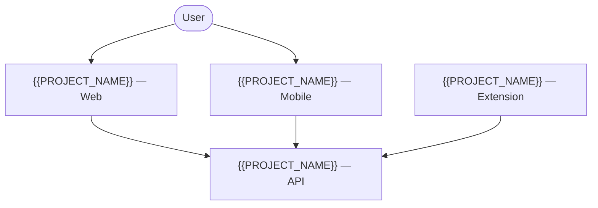

# {{PROJECT_NAME}} — Map of Content

## Overview

_Brief description of what {{PROJECT_NAME}} is and its purpose._

## Components

- [[{{PROJECT_NAME}} — Web]] — _web application_
- [[{{PROJECT_NAME}} — API]] — _backend API_
- [[{{PROJECT_NAME}} — Mobile]] — _mobile app_
- [[{{PROJECT_NAME}} — Extension]] — _browser extension_

_Adjust component list to match actual project components._

### Component Diagram

_Replace nodes and edges with the actual components and their dependencies._

## Documentation

- [[{{PROJECT_NAME}}/_wiki/]] — _deepwiki or project documentation_
- [[{{PROJECT_NAME}}/README]] — _project README_

## Related

- [[{{CONTEXT_NAME}} MOC]] — _parent context_
- [[Infraestrutura MOC]] — _shared infrastructure used by this project_

## Decisions

- _Link to ADRs using the FULL filename stem (with slug), not the short form. Correct: `[[Decisions/ADR-01-use-oauth2-auth|ADR-01: Use OAuth2]]`. Wrong: `[[Decisions/ADR-01]]` (file doesn't exist — actual file is `ADR-01-slug.md`)._
- _List all ADRs from `Decisions/*.md`._

## Activity

- _Link to daily notes or logbook entries related to this project._
